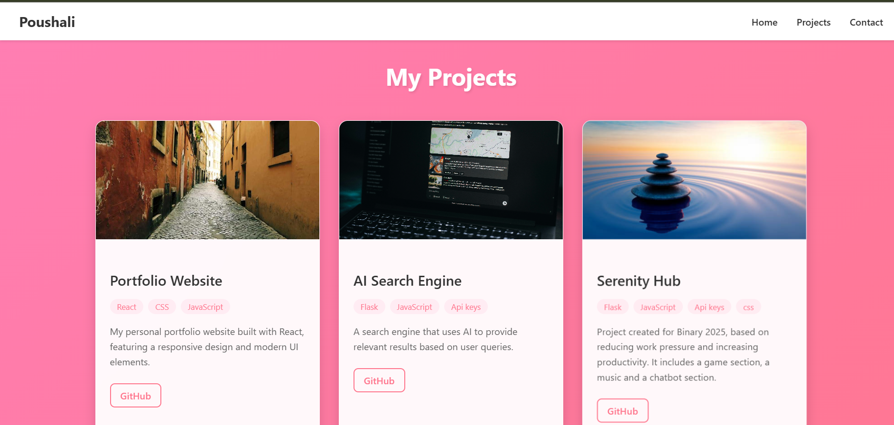

# Personal Portfolio Website

## 🚀 Overview
A modern and responsive portfolio website built with React and Flask, showcasing my projects and skills in Machine Learning, AI, and Web Development.

## ✨ Features
- Responsive design
- Interactive UI with modern animations
- Contact form with validation
- Tech stack showcase
- Project portfolio
- Social media integration

## 🛠 Tech Stack
### Frontend
- React.js
- CSS3
- JavaScript
- Font Awesome icons

### Backend
- Flask
- SQLite
- Python

## 📦 Installation

### Prerequisites
- Node.js
- Python 3.13.3 (I used this, any other version is suitable)
- npm or yarn

### Frontend Setup
```bash
cd Frontend
npm install
npm start
```

### Backend Setup
```bash
cd Backend
pip install -r requirements.txt
python app.py
```

## 📱 Features in Detail
1. **Home Page**
   - Professional introduction
   - Tech stack display
   - Social media links
   - Resume download option (will be given soon)
   - 

2. **Projects Section**
   - Project showcase with images
   - Project descriptions
   - Live demo links (will be there soon)
   - 

3. **Contact Form**
   - Form validation
   - Protection against spam
   - Success/error notifications
   - 

## 🔗 Usage
Visit `http://localhost:3000` to view the website after starting both frontend and backend servers.

## 👤 Contact
- GitHub: [@Poushali-02](https://github.com/Poushali-02)
- LinkedIn: [Poushali Bhattacharyya](https://www.linkedin.com/in/poushali-bhattacharyya-555238342/)

## 🤝 Contributing
1. Fork the repository
2. Create your feature branch (`git checkout -b feature/AmazingFeature`)
3. Commit your changes (`git commit -m 'Add some AmazingFeature'`)
4. Push to the branch (`git push origin feature/AmazingFeature`)
5. Open a Pull Request
